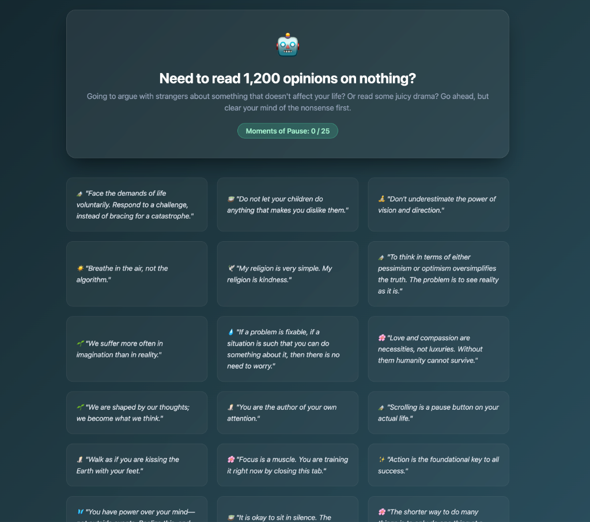
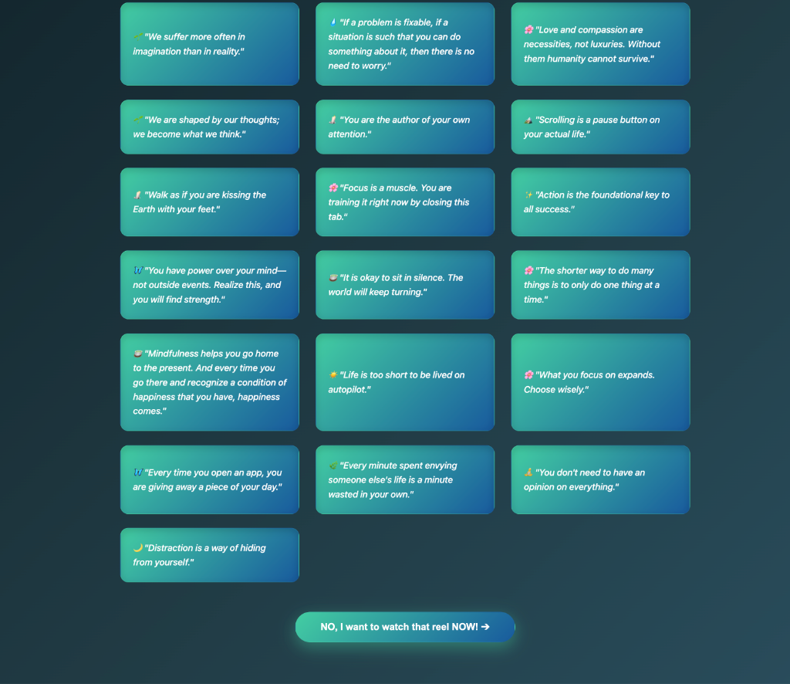
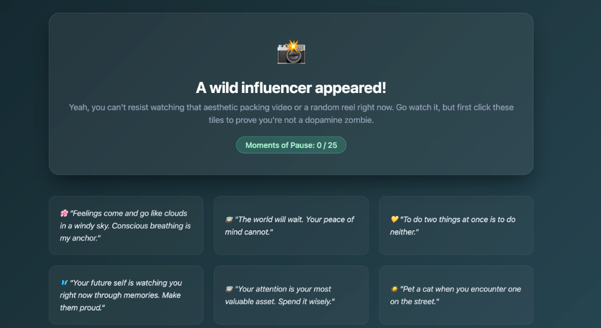
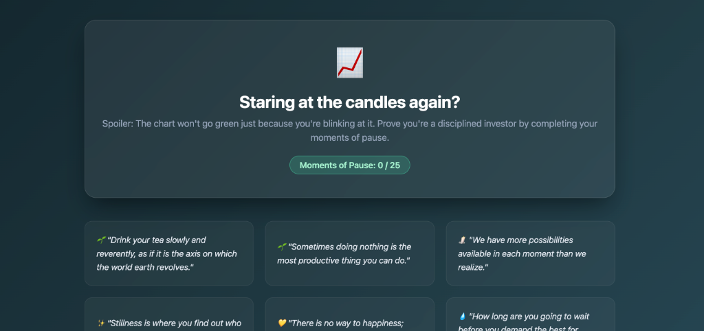
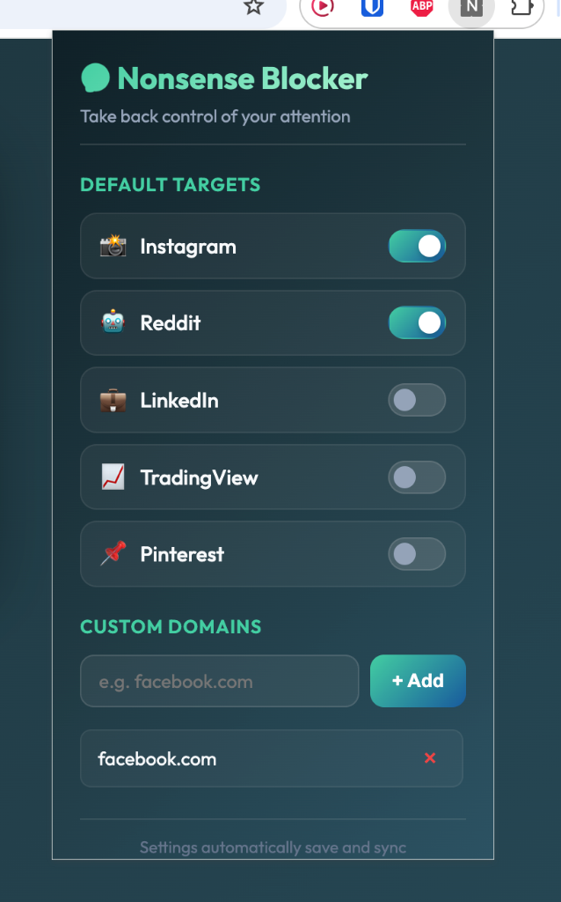

# Nonsense Blocker

Yeah social media is bad, screen time is ruinous, bla bla bla. Just use this tool to stop wasting your life.

## How It Works

You try to go to a distracting website. We block you and make you click a grid of tiles (moments of pause) to reveal quotes before letting you through. By the time you finish clicking, you might actually remember you have a life.

### Quick View

| 1. Blocked (Need to click 25 tiles) | 2. Unlocked (Click the button to proceed) |
| --- | --- |
|  |  |

| Custom Instagram Roast | Custom TradingView Roast |
| --- | --- |
|  |  |

| Blocker Dashboard (Configure settings) |
| --- |
|  |


### What We Block by Default
* **Instagram** (influencer packing videos and mindless reels)
* **Reddit** (pointless arguments with strangers)
* **LinkedIn** (hustle cringe and B2B sales lessons from coffee cups)
* **TradingView** (watching red/green candles go up and down)
* **Pinterest** (boards for DIY projects you'll never start)

---

## Quick Setup (Chrome Local Mode)

1. **Download this folder**
   * **No Git:** Download the ZIP from GitHub and unzip it.
   * **With Git:** Run:
     ```bash
     git clone https://github.com/HarshitJn/nonsense-blocker.git
     ```
2. **Go to Chrome Settings**
   * Open Chrome and navigate to `chrome://extensions/`.
3. **Turn on Developer Mode**
   * Toggle the **Developer mode** switch in the top-right corner to **ON**.
4. **Load Unpacked**
   * Click **Load unpacked** (top-left) and select this folder.

Done. Go try opening Instagram.

---

## Want to block more nonsense?

You don't need to edit the code anymore! Just click on the extension icon in your Chrome toolbar to open the **Nonsense Blocker Dashboard**:
- **Toggle Defaults**: Switch blocking on/off for standard distracting sites (Instagram and Reddit are blocked by default).
- **Add Custom Sites**: Enter any domain (e.g., `facebook.com` or `youtube.com`) and click **+ Add**.
- **Remove Sites**: Click the **×** button next to any custom domain to stop blocking it.

*(Optional)*: If you add new domains, open [quotes.js](file:///Users/harshit/.gemini/antigravity/scratch/nonsense-blocker/quotes.js) and add a custom roasting message to the `funnyCustomizations` mapping to get roasted dynamically.

---

## Running Tests

To verify that your custom rules are valid JSON and that your regular expressions match correctly, run:
```bash
node test.js
```
